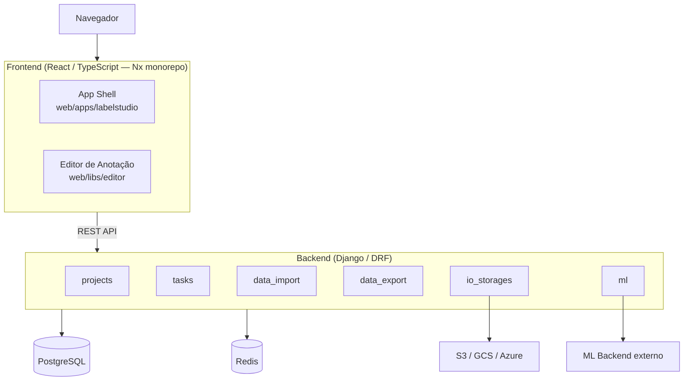

# Arquitetura do Label Studio

## Visão Geral

O Label Studio é uma ferramenta open-source de **rotulagem de dados para machine learning**. Permite criar projetos de anotação para múltiplos tipos de dado — imagens, texto, áudio, vídeo, séries temporais e HTML — com interfaces de anotação configuráveis via XML. Equipes de anotadores trabalham de forma colaborativa, e os dados rotulados podem ser exportados em formatos prontos para treinamento (COCO, YOLO, Pascal VOC, CSV). A ferramenta também se integra com backends de ML externos para fornecer pré-anotações automáticas aos anotadores.

Internamente, segue o padrão **cliente-servidor**: frontend React + backend Django comunicando-se via API REST.

**Stack:** React 18 / TypeScript (frontend) · Django 5.1 + DRF (backend) · PostgreSQL / SQLite (banco) · Redis + Django-RQ (fila assíncrona, opcional)

---

## Justificativa da Arquitetura

A separação *cliente-servidor* responde a duas naturezas de problema muito diferentes. A anotação de dados é uma tarefa intensamente interativa — canvas, atalhos de teclado, feedback imediato, manipulação de mídia — que exige um cliente rico; já controle de acesso, persistência, importação/exportação e integridade dos dados são responsabilidades de servidor. Acoplar as duas em templates renderizados no servidor tornaria o editor inviável; separá-las permite que cada lado evolua no seu próprio ritmo.

A *API REST* como único contrato entre as partes é o que permite que o mesmo backend atenda simultaneamente à interface web, ao SDK Python e aos backends de ML externos, sem código duplicado por cliente.

No backend, a organização em *apps Django por domínio* (`projects`, `tasks`, `ml`, `data_export`...), cada um com seus próprios `models.py`, `api.py` e `serializers.py`, aplica o princípio de Separation of Concerns no nível de módulo. O ganho prático é o isolamento de mudanças: a refatoração realizada no Caminho B deste trabalho ficou inteiramente contida em `labels_manager/serializers.py`, sem exigir alteração em nenhum outro módulo — o que só é possível porque as fronteiras entre os domínios são explícitas.

O *trade-off* dessa escolha é o custo de operação: são dois ecossistemas de build (Poetry e Nx/Yarn), dois pipelines de teste e maior complexidade de setup local do que teria um monólito Django tradicional. Para um projeto do porte do Label Studio — múltiplos tipos de mídia, editor reutilizável como biblioteca, integrações externas plugáveis — o custo se justifica; para uma aplicação CRUD simples, não se justificaria.

---

## Diagrama de Componentes

---

## Módulos do Backend

| Módulo | Responsabilidade |
|--------|-----------------|
| `core` | Configurações, middlewares, utilitários |
| `users` / `organizations` | Autenticação JWT, multi-tenancy |
| `projects` | Projetos e label config (XML) |
| `tasks` | Tasks, anotações e predições |
| `data_import` | Upload e parsing de CSV/JSON |
| `data_export` | Exportação (COCO, YOLO, CSV...) |
| `data_manager` | Filtros e ações em massa |
| `io_storages` | Integração com cloud storage |
| `ml` | Cliente HTTP para ML backends |
| `webhooks` | Notificações de eventos |
| `fsm` | Máquina de estados do projeto |

---

## Padrões Arquiteturais

- **REST API** — toda comunicação frontend-backend via HTTP/JSON (DRF)
- **Repository Pattern** — managers Django encapsulam queries reutilizáveis (`Project.objects.for_user(user)`)
- **Strategy Pattern** — `io_storages` define interface base implementada por S3, GCS e Azure
- **Observer / Signal** — sinais Django desacoplam efeitos colaterais (recálculo de estatísticas, webhooks)
